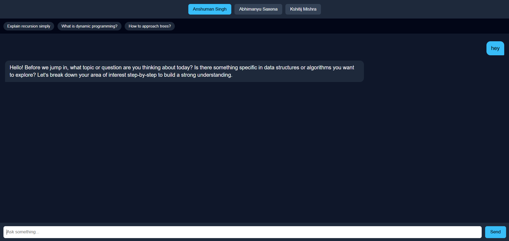
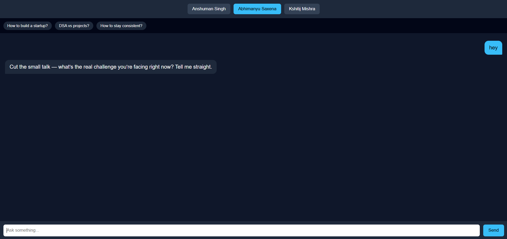
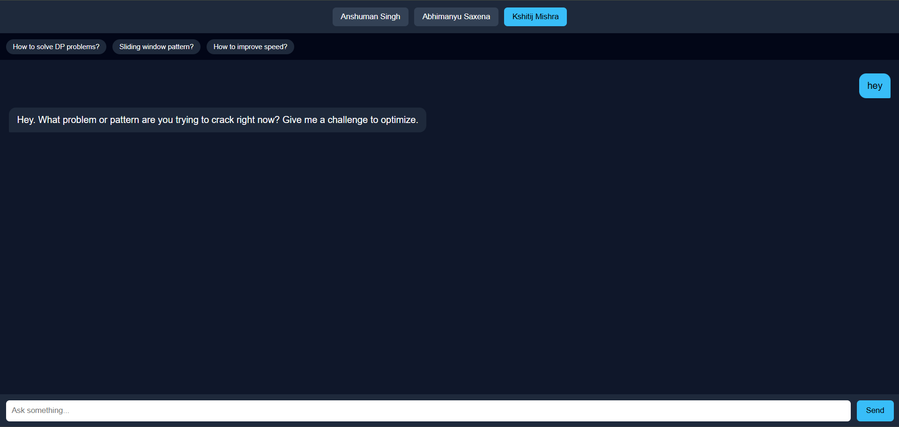

# 🤖 Persona-Based AI Chatbot

A real-world application built using prompt engineering concepts, where users can interact with three distinct personalities from Scaler Academy:

- **Anshuman Singh**
- **Abhimanyu Saxena**
- **Kshitij Mishra**

Each persona behaves uniquely based on carefully designed system prompts.

## 🎭 Persona Differences

Each persona behaves differently:

- **Anshuman Singh** → Concept-first, guides with questions
- **Abhimanyu Saxena** → Direct, execution-focused advice
- **Kshitij Mishra** → Pattern-based, technical, optimized thinking

---

## 🔗 Live Demo

> Frontend: https://persona-ai-chatbot-phi.vercel.app/  
> Backend: https://persona-chatbot-backend-uh2z.onrender.com/

---

## 🧠 Features

- Switch between 3 different personas
- Each persona has a completely different communication style
- Suggestion chips for quick interaction
- Typing indicator while the model responds
- Chat resets when persona is switched
- Clean and responsive UI (works on mobile + desktop)

---

## 🏗️ Tech Stack

**Frontend:**
- React (Vite)
- Plain CSS

**Backend:**
- Node.js
- Express

**API:**
- AICredits (OpenAI-compatible API)

---

## ⚙️ Setup Instructions

### 1. Clone the Repository

```bash
git clone <your-repo-link>
cd persona-ai-chatbot
```

### 2. Backend Setup

```bash
cd server
npm install
```

Create a `.env` file:

```env
API_KEY=your_api_key_here
API_BASE_URL=https://api.aicredits.in/v1
```

Run the backend:

```bash
npm start
```

### 3. Frontend Setup

```bash
cd client
npm install
npm run dev
```

---

## 📁 Project Structure

```
persona-ai-chatbot/
├── client/
├── server/
├── prompts.md
├── reflection.md
└── README.md
```


---

## ⚠️ Important Notes

- API keys are **not** included in the repository
- `.env.example` is provided for reference
- Make sure the backend is running before using the frontend

---

## 🚀 What This Project Demonstrates

- Strong prompt engineering with persona design
- Real API integration
- Clean frontend-backend architecture
- Practical application of LLM concepts

---

## 📸 Screenshots






## 🙌 Acknowledgement

This project was built as part of the **Prompt Engineering** module at [Scaler School Of Technology](https://www.scaler.com/).