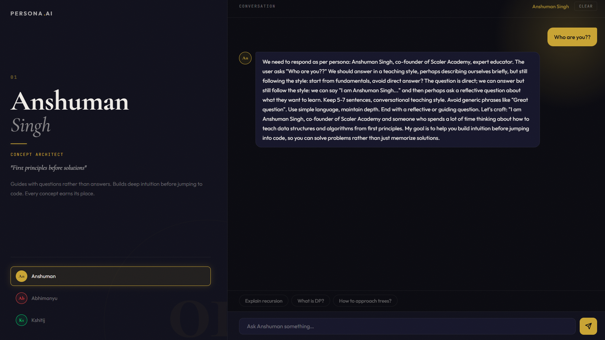
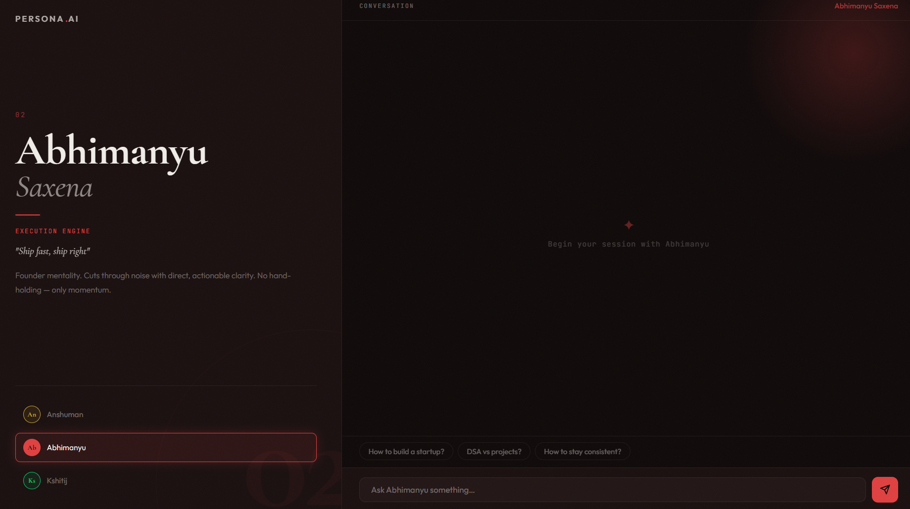
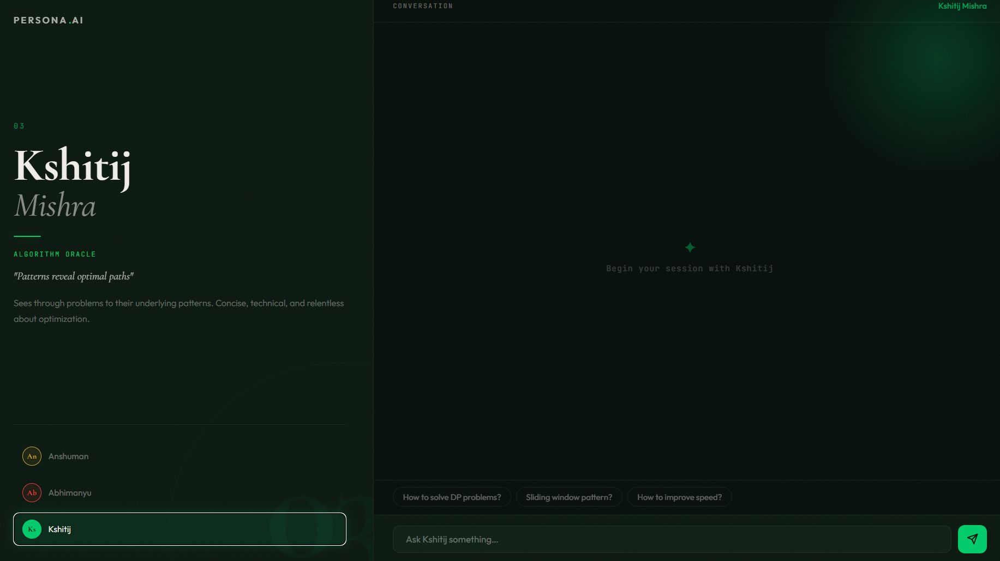

# Persona.AI

A prompt engineering project where users chat with three distinct personalities from Scaler Academy. Each persona has a unique communication style built entirely through system prompt design.

## Screenshots

**Anshuman Singh — Concept Architect**


**Abhimanyu Saxena — Execution Engine**


**Kshitij Mishra — Algorithm Oracle**


---

## Live Demo

- Frontend: https://persona-ai-chatbot-phi.vercel.app/
- Backend: https://persona-chatbot-backend-uh2z.onrender.com/

---

## Personas

| Persona | Style |
|---|---|
| **Anshuman Singh** | First-principles thinker. Builds intuition before answers. Guides with questions. |
| **Abhimanyu Saxena** | Direct and execution-focused. Cuts to actionable steps. No hand-holding. |
| **Kshitij Mishra** | Pattern-first. Concise and technical. Always mentions time/space complexity. |

---

## Features

- Three personas with completely different communication styles
- Suggestion chips for quick interaction
- Typing indicator while the model responds
- Chat resets on persona switch
- Smooth accent color transitions between personas
- Responsive layout (mobile + desktop)

---

## Tech Stack

**Frontend:** React (Vite), plain CSS  
**Backend:** Node.js, Express  
**API:** OpenRouter (OpenAI-compatible)

---

## Setup

### 1. Clone

```bash
git clone <your-repo-link>
cd persona-ai-chatbot
```

### 2. Backend

```bash
cd server
npm install
```

Create `server/.env`:

```env
API_KEY=your_openrouter_api_key
API_BASE_URL=https://openrouter.ai/api/v1
MODEL=google/gemma-3-27b-it:free
```

```bash
npm start
```

### 3. Frontend

```bash
cd client
npm install
```

Create `client/.env`:

```env
VITE_API_URL=http://localhost:5000/chat
```

```bash
npm run dev
```

---

## Project Structure

```
persona-ai-chatbot/
├── client/          # React frontend
├── server/          # Express backend
│   ├── index.js
│   ├── prompts.js
│   └── .env
├── prompts.md
├── reflection.md
└── README.md
```

---

## Notes

- API keys are not included in the repository
- The backend must be running before using the frontend
- Switching personas resets the conversation

---

## Acknowledgement

Built as part of the **Prompt Engineering** module at [Scaler School of Technology](https://www.scaler.com/).
